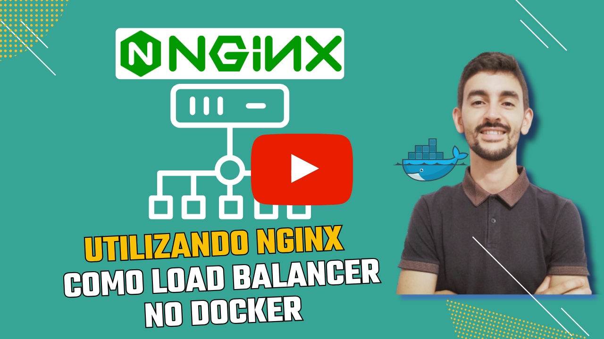

# Utilizando Nginx como Load Balancer no Docker

Neste vídeo, você aprenderá como configurar o **Nginx como Load Balancer** em um ambiente Docker, criando uma aplicação escalável e eficiente. Vou mostrar como preparar o ambiente utilizando **Docker** e **Docker Compose**, configurar o Nginx para gerenciar múltiplos servidores e distribuir o tráfego entre eles, garantindo alta disponibilidade e performance. Além disso, explicarei como configurar redes customizadas no Docker, implementar a arquitetura de balanceamento de carga e proteger as aplicações contra acessos diretos aos contêineres. Este vídeo é ideal para quem deseja construir aplicações robustas e escaláveis.

<!--
https://www.youtube.com/@renato-coelho
-->

## Apresentação em Vídeo

<p align="center">
  <a href="https://youtu.be/T1g_Z0zB6Mc" target="_blank"></a>
</p>

 

### Requisitos

+ 

+ 

+ 

+ 

## Deploy da aplicação

### Clonando o repositório

```bash
git clone https://github.com/Renatoelho/load-balancer.git load-balancer
```

### Ativando os Serviços

+ Acesse o diretório do projeto:

```bash
cd load-balancer/
```

+ Execute o comando para subir os serviços:

```bash
docker compose -p load-balancer -f docker-compose-lb.yaml up -d --build
```

# Referências

Balanceamento de carga, **WikiPédia.** Disponível em: <https://pt.wikipedia.org/wiki/Balanceamento_de_carga>. Acesso em: 23 jan. 2025.

Using nginx as HTTP load balancer, **nginx.org** Disponível em: <https://nginx.org/en/docs/http/load_balancing.html>. Acesso em: 23 jan. 2025.

FastAPI, **FastAPI**. Disponível em: <https://fastapi.tiangolo.com/>. Acesso em: 23 jan. 2025.

Networking in Compose, **Docker Docs**. Disponível em: <https://docs.docker.com/compose/how-tos/networking/>. Acesso em: 23 jan. 2025.
